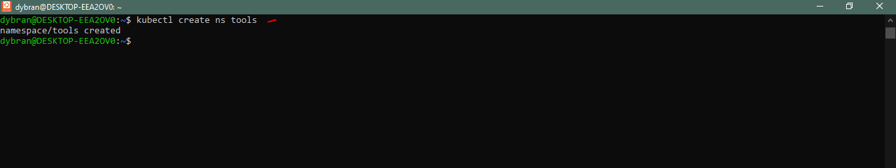

## __Deploying and Packaging Applications into Kubernetes with Helm__


In [Project-24](https://github.com/dybran/Project-24/blob/main/Project-24.md), we gained hands-on experience with Helm, utilizing it to deploy applications on Kubernetes.

In this new project, our aim is to deploy a range of DevOps tools, gaining familiarity with common real-world challenges encountered during such deployments and learning how to troubleshoot them effectively. We will delve into modifying Helm values files to automate application configurations. As we progressively deploy various DevOps tools, we will engage with them, understanding their role within the DevOps cycle and their integration into the broader ecosystem.

Our primary focus will be on:

- Artifactory
- Ingress Controllers
- Cert-Manager

Then

- Prometheus
- Grafana
- Elasticsearch ELK using [ECK](https://www.elastic.co/guide/en/cloud-on-k8s/current/k8s-install-helm.html).

Artifactory is part of a suit of products from a company called [Jfrog](https://jfrog.com/). __Jfrog__ started out as an artifact repository where software binaries in different formats are stored. Today, Jfrog has transitioned from an artifact repository to a DevOps Platform that includes CI and CD capabilities. This has been achieved by offering more products in which Jfrog Artifactory is part of. Other offerings include

- __JFrog Pipelines__ -  a CI-CD product that works well with its Artifactory repository. Think of this product as an alternative to Jenkins.
- __JFrog Xray__ - a security product that can be built-into various steps within a JFrog pipeline. Its job is to scan for security vulnerabilities in the stored artifacts. It is able to scan all dependent code.

In this project, the requirement is to use Jfrog Artifactory as a private registry for the organisation's Docker images and Helm charts. This requirement will satisfy part of the company's corporate security policies to never download artifacts directly from the public into production systems. We will eventually have a CI pipeline that initially pulls public docker images and helm charts from the internet, store in artifactory and scan the artifacts for security vulnerabilities before deploying into the corporate infrastructure. Any found vulnerabilities will immediately trigger an action to quarantine such artifacts.

__Deploy Jfrog Artifactory into Kubernetes__


First, we bring up the Kubernetes cluster. See [Project-22](https://github.com/dybran/Project-22/blob/main/Project-22.md) to set up __eksctl__.

Create kubeconfig file using awscli and connect to the kubectl.

`$ aws eks update-kubeconfig --name dybran-eks-tooling --region us-west-1`

Create a namespace __tools__ where all the DevOps tools will be deployed. We will also be deploying jenkins from the previous project in this namespace.

`$ kubectl create ns tools`



__Create and EBS-CSI Driver for the Cluster__

An EBS CSI driver is a crucial component in a Kubernetes cluster that utilizes Amazon Elastic Block Store (EBS) for persistent storage. It enables seamless integration between Kubernetes and EBS, allowing for dynamic provisioning, management, and lifecycle control of EBS volumes for containerized applications.

Here are the key reasons why an EBS CSI driver is essential for a Kubernetes cluster:

1. **Dynamic Provisioning:** The EBS CSI driver eliminates the need for manual EBS volume creation and configuration, enabling dynamic provisioning of EBS volumes directly within Kubernetes. This streamlines the storage provisioning process and reduces administrative overhead.

2. **Automated Attachment:** The EBS CSI driver automatically attaches and detaches EBS volumes to the appropriate Kubernetes nodes based on pod scheduling. This ensures that containers have access to the required storage without manual intervention.

3. **Volume Lifecycle Management:** The EBS CSI driver manages the entire lifecycle of EBS volumes, including creation, deletion, resizing, and snapshotting. This provides a unified approach to storage management within Kubernetes.

4. **Simplified Storage Management:** The EBS CSI driver simplifies storage management in Kubernetes by decoupling the storage interface from the Kubernetes controller manager. This allows for more efficient storage management and reduces the complexity of the Kubernetes control plane.

5. **Enhanced Storage Flexibility:** The EBS CSI driver supports a variety of EBS volume configurations, including different volume types, sizes, and performance options. This provides greater flexibility in tailoring storage to specific application requirements.

6. **Integration with Kubernetes Ecosystem:** The EBS CSI driver is fully integrated with the Kubernetes ecosystem, including Kubernetes PersistentVolumes, PersistentVolumeClaims, and StorageClasses. This allows for seamless integration with existing Kubernetes storage workflows.

Overall, the EBS CSI driver plays a critical role in enabling Kubernetes clusters to effectively leverage EBS for persistent storage. It simplifies storage management, automates volume lifecycle operations, and enhances storage flexibility, making it an indispensable tool for Kubernetes environments.

Install EBS CSI Driver

__IAM Role Setup__

Create an __IAM role__ with the necessary permissions for the EBS CSI Driver to interact with EBS volumes. The Amazon EBS CSI plugin requires IAM permissions to make calls to AWS APIs on your behalf. The The example policy can be used to define the required permissions. Additionally, AWS provides a managed policy at ARN __arn:aws-us-gov:iam::aws:policy/service-role/AmazonEBSCSIDriverPolicy__ which we will make use here.

__Create an __IAM OIDC provider__ for your cluster using the AWS CLI.__

- Determine the OIDC issuer ID for your cluster; Retrieve your cluster's OIDC issuer ID and store it in a variable.

```
cluster_name=dybran-eks-tooling

oidc_id=$(aws eks describe-cluster --name $cluster_name --query "cluster.identity.oidc.issuer" --output text | cut -d '/' -f 5)

echo $oidc_id
```

- Determine whether an IAM OIDC provider with your cluster's issuer ID is already in your account.

`aws iam list-open-id-connect-providers | grep $oidc_id | cut -d "/" -f4`

If output is returned, then you already have an __IAM OIDC__ provider for your cluster and you can skip the next step. If no output is returned, then you must create an __IAM OIDC__ provider for your cluster.

- Create an IAM OIDC identity provider for your cluster with the following command.

`eksctl utils associate-iam-oidc-provider --cluster $cluster_name --approve`

__Create your Amazon EBS CSI plugin IAM role with the AWS CLI__

- View your cluster's OIDC provider URL. If the output from the command is None, review __IAM Role Setup__ and __Create an __IAM OIDC provider__ for your cluster using the AWS CLI.__ above.


`$ aws eks describe-cluster --name $cluster_name --query "cluster.identity.oidc.issuer" --output text`

- Create the IAM role, granting the __AssumeRoleWithWebIdentity__ action.

Create a file __aws-ebs-csi-driver-trust-policy.json__ and copy the following content to the file.

```
{
  "Version": "2012-10-17",
  "Statement": [
    {
      "Effect": "Allow",
      "Principal": {
        "Federated": "arn:aws-us-gov:iam::939895954199:oidc-provider/oidc.eks.us-west-1.amazonaws.com/id/EXAMPLED539D4633E53DE1B71EXAMPLE"
      },
      "Action": "sts:AssumeRoleWithWebIdentity",
      "Condition": {
        "StringEquals": {
          "oidc.eks.us-west-1.amazonaws.com/id/EXAMPLED539D4633E53DE1B71EXAMPLE:aud": "sts.amazonaws.com",
          "oidc.eks.us-west-1.amazonaws.com/id/EXAMPLED539D4633E53DE1B71EXAMPLE:sub": "system:serviceaccount:kube-system:ebs-csi-controller-sa"
        }
      }
    }
  ]
}
```

Create the role __EBS_CSI_DriverRole__

```
aws iam create-role \
  --role-name EBS_CSI_DriverRole \
  --assume-role-policy-document file://"aws-ebs-csi-driver-trust-policy.json"
```

You can attach a policy to your AWS setup in two ways:
 - By using an AWS managed policy 

OR

- By crafting your own custom policy.

Should your cluster exist in the __AWS GovCloud (US-East)__ or __AWS GovCloud (US-West)__ regions, substitute __"arn:aws:"__ with __"arn:aws-us-gov:"__.

To connect the AWS managed policy to the role

```
aws iam attach-role-policy \
  --policy-arn arn:aws-us-gov:iam::aws:policy/service-role/AmazonEBSCSIDriverPolicy \
  --role-name EBS_CSI_DriverRole
```
__Managing the Amazon EBS CSI driver as an Amazon EKS add-on__
To add the __Amazon EBS CSI add-on__ using the __AWS CLI__

Run the following command

```
aws eks create-addon --cluster-name $cluster_name --addon-name aws-ebs-csi-driver \
  --service-account-role-arn arn:aws-us-gov:iam::939895954199:role/EBS_CSI_DriverRole
```
__Installing the tools in kubernetes__

The best approach to easily get Artifactory into kubernetes is to use helm.

Search for an official helm chart for Artifactory on [Artifact Hub](https://artifacthub.io/).


Click on __install__ to display the commands for  installation.


Add the repo

`$ helm repo add jfrog https://charts.jfrog.io`

Update the helm repo index on my local machine/laptop

`$ helm repo update`

Install artifactory in the namespace __tools__

`$ helm upgrade --install artifactory jfrog/artifactory --version 107.71.4 -n tools`


We opted for the `upgrade --install` flag over `helm install artifactory jfrog/artifactory` for enhanced best practices, especially in CI pipeline development for helm deployments. This approach guarantees that helm performs an upgrade if an installation exists. In the absence of an existing installation, it conducts the initial install. This strategy assures a fail-safe command; it intelligently discerns whether an upgrade or a fresh installation is needed, preventing failures.

To see the various versions


__PROBLEMS ENCOUNTERED__

Upon deploying Jenkins via helm, it worked smoothly. However, the deployment of Artifactory pods using helm encountered an issue. The "router" init pod remained stuck in a __"podinitializing"__ state, while the posegresql pod was functioning properly.


__Resolution__

Upon investigation, I discovered that Artifactory requires more __storage volume__. 

To address this, I increased the __storage volume__ of the node instances, upgrading __volume size__ from __10 GB__ to __80GB__.


