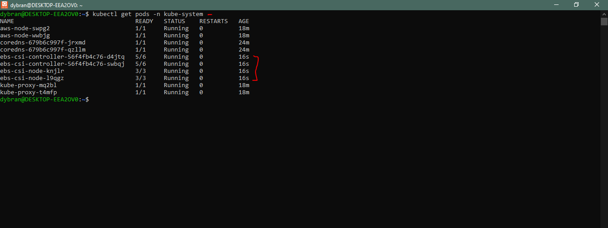

## __Deploying and Packaging Applications into Kubernetes with Helm__


In [Project-24](https://github.com/dybran/Project-24/blob/main/Project-24.md), we acquired practical skills in using Helm to deploy applications on Kubernetes.

Now, in this project, we are focusing on deploying a suite of DevOps tools. Our goal is to confront and understand the typical challenges faced in real-world deployments while mastering effective troubleshooting strategies. We will explore the customization of Helm values files to automate application setups. Throughout the process of deploying different DevOps tools, we'll actively interact with them, comprehending their place in the DevOps lifecycle and how they integrate into the larger ecosystem.

Our primary focus will be on:

- Artifactory
- Ingress Controllers
- Cert-Manager

Then

- Prometheus
- Grafana
- Elasticsearch ELK using [ECK](https://www.elastic.co/guide/en/cloud-on-k8s/current/k8s-install-helm.html).

Artifactory is part of a suit of products from a company called [Jfrog](https://jfrog.com/). __Jfrog__ started out as an artifact repository where software binaries in different formats are stored. Today, Jfrog has transitioned from an artifact repository to a DevOps Platform that includes CI and CD capabilities. This has been achieved by offering more products in which Jfrog Artifactory is part of. Other offerings include

- __JFrog Pipelines__ -  a CI-CD product that works well with its Artifactory repository. Think of this product as an alternative to Jenkins.
- __JFrog Xray__ - a security product that can be built-into various steps within a JFrog pipeline. Its job is to scan for security vulnerabilities in the stored artifacts. It is able to scan all dependent code.

In this project, the requirement is to use Jfrog Artifactory as a private registry for the organisation's Docker images and Helm charts. This requirement will satisfy part of the company's corporate security policies to never download artifacts directly from the public into production systems. We will eventually have a CI pipeline that initially pulls public docker images and helm charts from the internet, store in artifactory and scan the artifacts for security vulnerabilities before deploying into the corporate infrastructure. Any found vulnerabilities will immediately trigger an action to quarantine such artifacts.

__Deploy Jfrog Artifactory into Kubernetes__


First, we provision the kubernetes cluster using __eksctl__. See [Project-22](https://github.com/dybran/Project-22/blob/main/Project-22.md).

Create kubeconfig file using awscli and connect to the kubectl.

`$ aws eks update-kubeconfig --name dybran-eks-tooling --region us-west-1`

Create a namespace __tools__ where all the DevOps tools will be deployed. We will also be deploying jenkins from the previous project in this namespace.

`$ kubectl create ns tools`


__Create EBS-CSI Driver for the Cluster__

An __EBS CSI driver__ is a crucial component in a Kubernetes cluster that utilizes Amazon Elastic Block Store (EBS) for persistent storage. It enables seamless integration between Kubernetes and EBS, allowing for dynamic provisioning, management, and lifecycle control of EBS volumes for containerized applications.

Here are the key reasons why an EBS CSI driver is essential for a Kubernetes cluster:

1. **Dynamic Provisioning:** The EBS CSI driver eliminates the need for manual EBS volume creation and configuration, enabling dynamic provisioning of EBS volumes directly within Kubernetes. This streamlines the storage provisioning process and reduces administrative overhead.

2. **Automated Attachment:** The EBS CSI driver automatically attaches and detaches EBS volumes to the appropriate Kubernetes nodes based on pod scheduling. This ensures that containers have access to the required storage without manual intervention.

3. **Volume Lifecycle Management:** The EBS CSI driver manages the entire lifecycle of EBS volumes, including creation, deletion, resizing, and snapshotting. This provides a unified approach to storage management within Kubernetes.

4. **Simplified Storage Management:** The EBS CSI driver simplifies storage management in Kubernetes by decoupling the storage interface from the Kubernetes controller manager. This allows for more efficient storage management and reduces the complexity of the Kubernetes control plane.

5. **Enhanced Storage Flexibility:** The EBS CSI driver supports a variety of EBS volume configurations, including different volume types, sizes, and performance options. This provides greater flexibility in tailoring storage to specific application requirements.

6. **Integration with Kubernetes Ecosystem:** The EBS CSI driver is fully integrated with the Kubernetes ecosystem, including Kubernetes PersistentVolumes, PersistentVolumeClaims, and StorageClasses. This allows for seamless integration with existing Kubernetes storage workflows.

Overall, the EBS CSI driver plays a critical role in enabling Kubernetes clusters to effectively leverage EBS for persistent storage. It simplifies storage management, automates volume lifecycle operations, and enhances storage flexibility, making it an indispensable tool for Kubernetes environments.

__Installing EBS CSI Driver__

Check the link to setuo the [__EBS CSI add-on__](https://docs.aws.amazon.com/eks/latest/userguide/managing-ebs-csi.html)

Use this command to check the necessary platform version.

`$ aws eks describe-addon-versions --addon-name aws-ebs-csi-driver`


You might already have an AWS IAM OpenID Connect (OIDC) provider for your cluster. To confirm its existence or establish a new one, check the OIDC issuer URL linked to your cluster. An IAM OIDC provider is necessary for utilizing IAM roles with service accounts. You can set up an IAM OIDC provider for your cluster using either __eksctl or the AWS Management Console__.

__To create an IAM OIDC identity provider for your cluster with eksctl__

Determine the OIDC issuer ID for your cluster.

Retrieve your cluster's OIDC issuer ID and store it in a variable.

`$ cluster_name=dybran-eks-tooling`

`$ oidc_id=$(aws eks describe-cluster --name $cluster_name --region us-west-1 --query "cluster.identity.oidc.issuer" --output text | cut -d '/' -f 5)`

`$ echo $oidc_id`


Determine whether an IAM OIDC provider with your cluster's issuer ID is already in your account

`$ aws iam list-open-id-connect-providers | grep $oidc_id | cut -d "/" -f4`

If output is returned, then you already have an IAM OIDC provider for your cluster and you can skip the next step. If no output is returned, then you must create an IAM OIDC provider for your cluster.

In this case, no output was returned.


Create an IAM OIDC identity provider for your cluster with the following command

`$ eksctl utils associate-iam-oidc-provider --cluster $cluster_name --region us-west-1 --approve`


__Configuring a Kubernetes service account to assume an IAM role__

Create a file __aws-ebs-csi-driver-trust-policy.json__ that includes the permissions for the AWS services

```
cat >aws-ebs-csi-driver-trust-policy.json <<EOF
{
  "Version": "2012-10-17",
  "Statement": [
    {
      "Effect": "Allow",
      "Principal": {
        "Federated": "arn:aws:iam::939895954199:oidc-provider/oidc.eks.us-west-1.amazonaws.com/id/$oidc_id"
      },
      "Action": "sts:AssumeRoleWithWebIdentity",
      "Condition": {
        "StringEquals": {
          "oidc.eks.us-west-1.amazonaws.com/id/$oidc_id:aud": "sts.amazonaws.com",
          "oidc.eks.us-west-1.amazonaws.com/id/$oidc_id:sub": "system:serviceaccount:kube-system:ebs-csi-controller-sa"
        }
      }
    }
  ]
}
EOF
```
This trust policy essentially allows the EBS CSI driver to assume the role associated with the specified OIDC provider and access AWS resources on behalf of the EBS CSI controller service account

Create the role - __AmazonEKS_EBS_CSI_DriverRole__

```
aws iam create-role \
  --role-name AmazonEKS_EBS_CSI_DriverRole \
  --assume-role-policy-document file://"aws-ebs-csi-driver-trust-policy.json"
```

Attach a policy. AWS maintains an AWS managed policy or you can create your own custom policy. Attach the AWS managed policy to the role.

```
aws iam attach-role-policy \
  --policy-arn arn:aws:iam::aws:policy/service-role/AmazonEBSCSIDriverPolicy \
  --role-name AmazonEKS_EBS_CSI_DriverRole
```


To add the Amazon __EBS CSI add-on__ using the __AWS CLI__

Run the following command.

```
$ aws eks create-addon --cluster-name $cluster_name --addon-name aws-ebs-csi-driver \
  --service-account-role-arn arn:aws:iam::939895954199:role/AmazonEKS_EBS_CSI_DriverRole --region us-west-1
```


Run the command 

`$ kubectl get pods -n kube-system`



__Installing the tools in kubernetes__

The best approach to easily get tools into kubernetes is to use helm.

Install jenkins in the namespace __tools__ using helm

Search for an official helm chart for jenkins on [Artifact Hub](https://artifacthub.io/).

`$ helm repo add jenkins https://charts.jenkins.io`

`$ helm repo update`

`$ helm upgrade --install jenkins jenkins/jenkins -n tools`


Install artifactory in the namespace __tools__

Search for an official helm chart for Artifactory on [Artifact Hub](https://artifacthub.io/).


Click on __install__ to display the commands for  installation.


Add the repo

`$ helm repo add jfrog https://charts.jfrog.io`

Update the helm repo index on my local machine/laptop

`$ helm repo update`

Install artifactory in the namespace __tools__

`$ helm upgrade --install artifactory jfrog/artifactory --version 107.71.4 -n tools`


We opted for the `upgrade --install` flag over `helm install artifactory jfrog/artifactory` for enhanced best practices, especially in CI pipeline development for helm deployments. This approach guarantees that helm performs an upgrade if an installation exists. In the absence of an existing installation, it conducts the initial install. This strategy assures a fail-safe command; it intelligently discerns whether an upgrade or a fresh installation is needed, preventing failures.

To see the various versions


__Getting the Artifactory URL__

The artifactory helm chart comes bundled with the Artifactory software, a __PostgreSQL database__ and __an Nginx proxy__ which it uses to configure routes to the different capabilities of Artifactory. Getting the pods after some time, you should see something like the below.


Each of the deployed application have their respective services. This is how you will be able to reach either of them.

Notice that, the Nginx Proxy has been configured to use the service type of LoadBalancer. Therefore, to reach Artifactory, we will need to go through the Nginx proxy's service. Which happens to be a load balancer created in the cloud provider.

`$ kubectl get svc -n tools`


Accessing the artifactory using the Load balancer URL


Login using default 

__username__: admin

__password__: password


__How the Nginx URL for Artifactory is configured in Kubernetes__

How did Helm configure the URL in kubernetes?

Helm uses the __values.yaml__ file to set every single configuration that the chart has the capability to configure. The best place to get started with an off the shelve chart from __artifacthub.io__ is to get familiar with the __DEFAULT VALUES__ section on Artifact hub.


Explore key and value pairs within the system.

For instance, entering "__nginx__" into the search bar will display all the configured options for the nginx proxy. Choosing "__nginx.enabled__" from the list will promptly navigate you to the corresponding configuration in the YAML file.


Search for __nginx.service__ and choose __nginx.service.type__. This will display the configured Kubernetes service type for Nginx. By default, it appears as LoadBalancer.


To work directly with the values.yaml file, you can download the file locally by clicking on the download icon.


__Ingress controller__

Configuring applications in Kubernetes to be externally accessible often begins with setting the service type to a __Load Balancer__. However, this can lead to escalating expenses and complex management as the number of applications grows, resulting in a multitude of provisioned load balancers.

An optimal solution lies in leveraging Kubernetes Ingress instead, as detailed in [Kubernetes Ingress documentation](https://kubernetes.io/docs/concepts/services-networking/ingress/). Yet, this transition requires deploying an [__Ingress Controller__](https://kubernetes.io/docs/concepts/services-networking/ingress-controllers/).

One major advantage of employing an Ingress controller is its __ability to utilize a single load balancer across various deployed applications__. This consolidation allows for the reuse of the load balancer by services like Artifactory and other tools. Consequently, it significantly reduces cloud expenditure and minimizes the overhead associated with managing multiple load balancers, a topic we'll delve deeper into shortly.

For now, we will leave artifactory, move on to the next phase of configuration (Ingress, DNS(Route53) and Cert Manager), and then return to Artifactory to complete the setup so that it can serve as a private docker registry and repository for private helm charts.

__Deploying Ingress Controller and managing Ingress Resources__

An ingress in Kubernetes is an API object responsible for overseeing external access to services within the cluster. It handles tasks like load balancing, SSL termination, and name-based virtual hosting. Essentially, an Ingress facilitates the exposure of HTTP and HTTPS routes from outside the cluster to services within cluster. Traffic direction is managed by rules set within the Ingress resource.

To illustrate, here is a straightforward example where an Ingress directs all its traffic to a single Service


An ingress resource for Artifactory would looklike this

```
apiVersion: networking.k8s.io/v1
kind: Ingress
metadata:
  name: artifactory
spec:
  ingressClassName: nginx
  rules:
  - host: "tooling.artifactory.sandbox.svc.dybran.com"
    http:
      paths:
      - path: /
        pathType: Prefix
        backend:
          service:
            name: artifactory
            port:
              number: 8082

```

- An Ingress needs __apiVersion, kind, metadata__ and __spec__ fields
- The name of an Ingress object must be a valid DNS subdomain name
- Ingress frequently uses annotations to configure some options depending on the Ingress controller.
- Different Ingress controllers support different annotations. Therefore it is important to be up to date with the ingress controller's specific documentation to know what annotations are supported.
- It is recommended to always specify the ingress class name with the spec __ingressClassName: nginx__. This is how the Ingress controller is selected, especially when there are multiple configured ingress controllers in the cluster.
- The domain __dybran.com__ should be replaced with your own domain.

If you attempt to apply the specified YAML configuration for the ingress resource without an ingress controller, it won't function. For the Ingress resource to operate, the cluster must have an active ingress controller.
Unlike various controllers running as part of the kube-controller-manager—like the __Node Controller, Replica Controller, Deployment Controller, Job Controller, or Cloud Controller—Ingress controllers__ don't initiate automatically with the cluster.
Kubernetes officially supports and maintains __AWS, GCE, and NGINX ingress controllers__. However, numerous other 3rd-party Ingress controllers exist, offering similar functionalities alongside their distinct features. Among these, the officially supported ones include:

- {AKS Application Gateway Ingress Controller (Microsoft Azure)](https://learn.microsoft.com/en-gb/azure/application-gateway/tutorial-ingress-controller-add-on-existing)
- [Istio](https://istio.io/latest/docs/tasks/traffic-management/ingress/kubernetes-ingress/)
- [Traefik](https://doc.traefik.io/traefik/providers/kubernetes-ingress/)
- [Ambassador](https://www.getambassador.io/)
- [HA Proxy Ingress](https://haproxy-ingress.github.io/)
- [Kong](https://docs.konghq.com/kubernetes-ingress-controller/latest/)
- [Gloo](https://docs.solo.io/gloo-edge/latest/)

While there are more 3rd-party Ingress controllers available, the aforementioned ones are currently backed and maintained by Kubernetes. A [comparison matrix](https://kubevious.io/blog/post/comparing-top-ingress-controllers-for-kubernetes#comparison-matrix) of these controllers can assist in understanding their unique traits, aiding businesses in choosing the right fit for their requirements.
In a cluster, it's feasible to deploy multiple ingress controllers, thanks to the essence of an ingress class. By specifying the `spec ingressClassName` field on the ingress object, the appropriate ingress controller will be utilized by the ingress resource.

__Deploy Nginx Ingress Controller__

We will deploy and use the Nginx Ingress Controller. It is always the default choice when starting with Kubernetes projects. It is reliable and easy to use.
Since this controller is maintained by Kubernetes, there is an official guide the installation process. Hence, we wont be using artifacthub.io here. Even though you can still find ready to go charts there, it just makes sense to always use the [__official guide__](https://kubernetes.github.io/ingress-nginx/deploy/) in this scenario.

Using the Helm approach, according to the official guide;

- Install Nginx Ingress Controller in the ingress-nginx namespace

```
helm upgrade --install ingress-nginx ingress-nginx \
  --repo https://kubernetes.github.io/ingress-nginx \
  --namespace ingress-nginx --create-namespace

```
This command is idempotent. It installs the ingress controller if it is not already present. However, if the ingress controller is already installed, it will perform an upgrade instead.

`$ kubectl get pods --namespace=ingress-nginx`

The following command will wait for the ingress controller pod to be up, running, and ready

```
kubectl wait --namespace ingress-nginx \
  --for=condition=ready pod \
  --selector=app.kubernetes.io/component=controller \
  --timeout=120s

```
__OR__

We can also install the ingress-nginx using the same approach used in installing jenkins and artifactory.

Create a name space __ingress-nginx__

`$ kubectl create ns ingress-nginx`

Search for an official helm chart for ingress-nginx on [Artifact Hub](https://artifacthub.io/).

`$ helm repo add ingress-nginx https://kubernetes.github.io/ingress-nginx`

Update repo

`$ helm repo update`

Install ingress-nginx

`$ helm upgrade --install ingress-nginx ingress-nginx/ingress-nginx --version 4.8.3 -n ingress-nginx`


Get pods in the __ingress-nginx__ namespace

`$ kubectl get pods -n ingress-nginx -w`


Check to see the created load balancer in AWS.


`$ kubectl get svc -n ingress-nginx`


The ingress-nginx-controller service that was created is of the type LoadBalancer. That will be the load balancer to be used by all applications which require external access, and is using this ingress controller.
If you go ahead to AWS console, copy the address in the EXTERNAL-IP column, and search for the loadbalancer, you will see an output like below.


Check the IngressClass that identifies this ingress controller.

`$ kubectl get ingressclass -n ingress-nginx`


__Deploy Artifactory Ingress__

Now, it is time to configure the ingress so that we can route traffic to the Artifactory internal service, through the ingress controller's load balancer.


Notice the section with the configuration that selects the ingress controller using the __ingressClassName__

Create the __ingress-nginx.yaml__ manifest
```
cat <<EOF > ingress-nginx.yaml
apiVersion: networking.k8s.io/v1
kind: Ingress
metadata:
  name: artifactory
spec:
  ingressClassName: nginx
  rules:
  - host: "tooling.artifactory.sandbox.svc.dybran.com"
    http:
      paths:
      - path: /
        pathType: Prefix
        backend:
          service:
            name: artifactory
            port:
              number: 8082
EOF
```


__N/B__

While setting up the EBS CSI driver, I had to specify the region of the cluster.


