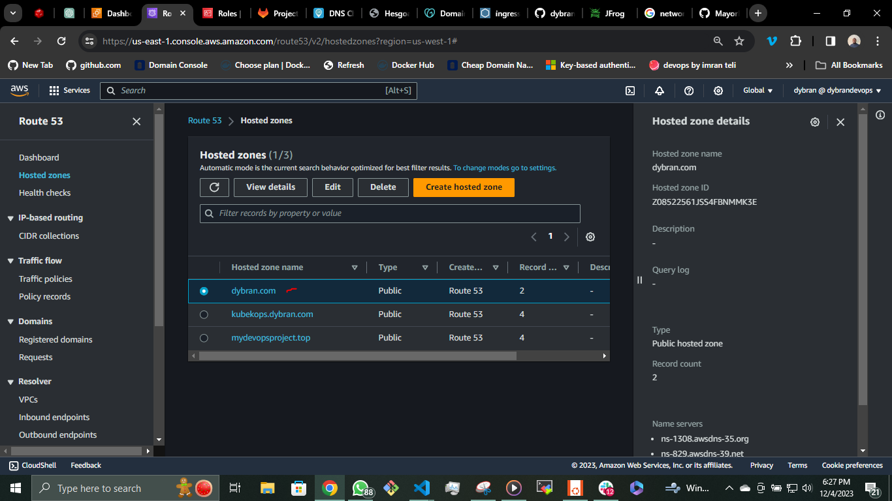
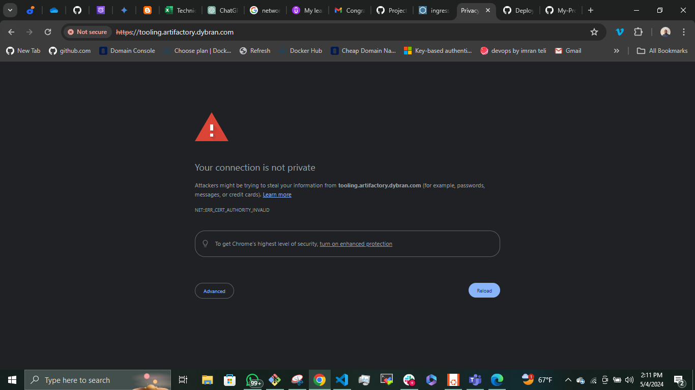
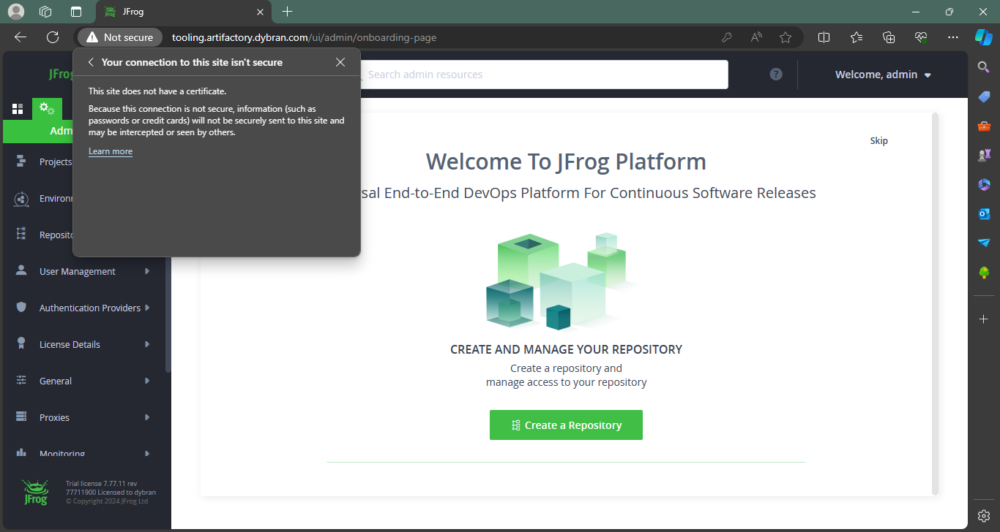
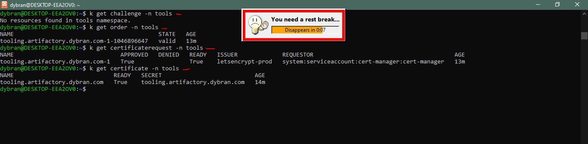

## __Deploying and Packaging Applications into Kubernetes with Helm__


In [the Previous Project](https://github.com/dybran/Project-24/blob/main/Project-24.md), we used Helm to deploy applications on Kubernetes.


__Aim of the project__

The aim of this project is to deploy a set of DevOps tools, focusing on identifying and addressing common challenges in real-world deployments while refining our troubleshooting techniques.

We will also customize Helm values files to automate the setup of applications and work closely with various DevOps tools, gaining insights into their role in the DevOps lifecycle and how they fit within the broader ecosystem.

Our primary focus will be on:

- Artifactory
- Ingress Controllers
- Cert-Manager

Then

- Prometheus
- Grafana
- Elasticsearch ELK using [ECK](https://www.elastic.co/guide/en/cloud-on-k8s/current/k8s-install-helm.html).

Artifactory is one of the products offered by [JFrog](https://jfrog.com/), a company known for its suite of software development tools. Initially, JFrog focused on creating an artifact repository to store software binaries in various formats. However, the company has since evolved into a comprehensive DevOps platform with CI/CD capabilities. This shift has been driven by the introduction of additional products that integrate with JFrog Artifactory. These include:

- __JFrog Pipelines__: A CI/CD tool designed to work seamlessly with Artifactory, serving as a possible alternative to Jenkins.
- __JFrog Xray__: A security tool that can be integrated at different stages of a JFrog pipeline. Its primary function is to scan stored artifacts for security vulnerabilities, including all dependent code.

__Project Requirement__

The Project requirement is to use Jfrog Artifactory as a private registry for the organisation's Docker images and Helm charts. This requirement will satisfy part of the company's corporate security policies to never download artifacts directly from the public into production systems. We will eventually have a CI pipeline that initially pulls public docker images and helm charts from the internet, store in artifactory and scan the artifacts for security vulnerabilities before deploying into the corporate infrastructure. Any found vulnerabilities will immediately trigger an action to quarantine such artifacts.

__Deploy Jfrog Artifactory into Kubernetes__

First, we provision the kubernetes cluster using __eksctl__. See [here](https://github.com/dybran/Project-22/blob/main/Project-22.md).


Create the cluster

`$ eksctl create cluster --name dybran-eks-tooling --region us-west-1 --nodegroup-name worker --node-type t3.medium --nodes 2`

Create kubeconfig file using awscli and connect to the kubectl.

`$ aws eks update-kubeconfig --name dybran-eks-tooling --region us-west-1`

Create a namespace __tools__ where all the DevOps tools will be deployed. We will also be deploying jenkins from the previous project in this namespace.

`$ kubectl create ns tools`


__Create EBS-CSI Driver for the Cluster__

An __EBS CSI driver__ is a crucial component in a Kubernetes cluster that utilizes Amazon Elastic Block Store (EBS) for persistent storage. It enables seamless integration between Kubernetes and EBS, allowing for dynamic provisioning, management, and lifecycle control of EBS volumes for containerized applications.

Here are the key reasons why an EBS CSI driver is essential for a Kubernetes cluster:

- __Dynamic Provisioning:__ The EBS CSI driver eliminates the need for manual EBS volume creation and configuration, enabling dynamic provisioning of EBS volumes directly within Kubernetes. This streamlines the storage provisioning process and reduces administrative overhead.

- __Automated Attachment:__ The EBS CSI driver automatically attaches and detaches EBS volumes to the appropriate Kubernetes nodes based on pod scheduling. This ensures that containers have access to the required storage without manual intervention.

- __Volume Lifecycle Management:__ The EBS CSI driver manages the entire lifecycle of EBS volumes, including creation, deletion, resizing, and snapshotting. This provides a unified approach to storage management within Kubernetes.

- __Simplified Storage Management:__ The EBS CSI driver simplifies storage management in Kubernetes by decoupling the storage interface from the Kubernetes controller manager. This allows for more efficient storage management and reduces the complexity of the Kubernetes control plane.

- __Enhanced Storage Flexibility:__ The EBS CSI driver supports a variety of EBS volume configurations, including different volume types, sizes, and performance options. This provides greater flexibility in tailoring storage to specific application requirements.

- __Integration with Kubernetes Ecosystem:__ The EBS CSI driver is fully integrated with the Kubernetes ecosystem, including Kubernetes PersistentVolumes, PersistentVolumeClaims, and StorageClasses. This allows for seamless integration with existing Kubernetes storage workflows.

Overall, the EBS CSI driver plays a critical role in enabling Kubernetes clusters to effectively leverage EBS for persistent storage. It simplifies storage management, automates volume lifecycle operations, and enhances storage flexibility, making it an indispensable tool for Kubernetes environments.

__Installing EBS CSI Driver__

Run the command to see the pods in the __kube-system__ namespace

`$ kubectl get pods -n kube-system`


By running this command, you will observe the presence of __coredns__, __kube-proxy__, and __aws-nodes__.

Once the __Ebs-csi driver__ is installed, additional nodes related to ebs-csi will appear in the __kube-system__ namespace.

Check the link to setup the [__EBS CSI add-on__](https://docs.aws.amazon.com/eks/latest/userguide/managing-ebs-csi.html)

Use this command to check the necessary platform version.

`$ aws eks describe-addon-versions --addon-name aws-ebs-csi-driver`


You might already have an AWS IAM OpenID Connect (OIDC) provider for your cluster. To confirm its existence or establish a new one, check the OIDC issuer URL linked to your cluster. An IAM OIDC provider is necessary for utilizing IAM roles with service accounts. You can set up an IAM OIDC provider for your cluster using either __eksctl or the AWS Management Console__.

__To create an IAM OIDC identity provider for your cluster with eksctl__

Determine the OIDC issuer ID for your cluster.

Retrieve your cluster's OIDC issuer ID and store it in a variable.

`$ cluster_name=dybran-eks-tooling`

`$ oidc_id=$(aws eks describe-cluster --name $cluster_name --region us-west-1 --query "cluster.identity.oidc.issuer" --output text | cut -d '/' -f 5)`

`$ echo $oidc_id`


Check if there's an IAM OIDC provider in your account that matches your cluster's issuer ID.

`$ aws iam list-open-id-connect-providers | grep $oidc_id | cut -d "/" -f4`

If output is returned, then you already have an IAM OIDC provider for your cluster and you can skip the next step. If no output is returned, then you must create an IAM OIDC provider for your cluster.

In this case, no output was returned.


Create an IAM OIDC identity provider for your cluster with the following command

`$ eksctl utils associate-iam-oidc-provider --cluster $cluster_name --region us-west-1 --approve`


__Configuring a Kubernetes service account to assume an IAM role__

Create a file __aws-ebs-csi-driver-trust-policy.json__ that includes the permissions for the AWS services

```
cat >aws-ebs-csi-driver-trust-policy.json <<EOF
{
  "Version": "2012-10-17",
  "Statement": [
    {
      "Effect": "Allow",
      "Principal": {
        "Federated": "arn:aws:iam::939895954199:oidc-provider/oidc.eks.us-west-1.amazonaws.com/id/$oidc_id"
      },
      "Action": "sts:AssumeRoleWithWebIdentity",
      "Condition": {
        "StringEquals": {
          "oidc.eks.us-west-1.amazonaws.com/id/$oidc_id:aud": "sts.amazonaws.com",
          "oidc.eks.us-west-1.amazonaws.com/id/$oidc_id:sub": "system:serviceaccount:kube-system:ebs-csi-controller-sa"
        }
      }
    }
  ]
}
EOF
```
This trust policy essentially allows the EBS CSI driver to assume the role associated with the specified OIDC provider and access AWS resources on behalf of the EBS CSI controller service account

Create the role - __AmazonEKS_EBS_CSI_DriverRole__

```
aws iam create-role \
  --role-name AmazonEKS_EBS_CSI_DriverRole \
  --assume-role-policy-document file://"aws-ebs-csi-driver-trust-policy.json"
```

Attach a policy. AWS maintains an AWS managed policy or you can create your own custom policy. Attach the AWS managed policy to the role.

```
aws iam attach-role-policy \
  --policy-arn arn:aws:iam::aws:policy/service-role/AmazonEBSCSIDriverPolicy \
  --role-name AmazonEKS_EBS_CSI_DriverRole
```


To add the Amazon __EBS CSI add-on__ using the __AWS CLI__

Run the following command.

```
aws eks create-addon --cluster-name $cluster_name --addon-name aws-ebs-csi-driver \
  --service-account-role-arn arn:aws:iam::939895954199:role/AmazonEKS_EBS_CSI_DriverRole --region us-west-1
```


Execute the command, you will find the __ebs-csi driver__ related pods available.

`$ kubectl get pods -n kube-system`


__Installing the tools in kubernetes__

The best approach to easily get tools into kubernetes is to use helm.

Install jenkins in the namespace __tools__ using helm

Search for an official helm chart for jenkins on [Artifact Hub](https://artifacthub.io/).

`$ helm repo add jenkins https://charts.jenkins.io`

`$ helm repo update`

`$ helm upgrade --install jenkins jenkins/jenkins -n tools`


Install artifactory in the namespace __tools__

Search for an official helm chart for Artifactory on [Artifact Hub](https://artifacthub.io/).


Click on __install__ to display the commands for  installation.


Add the repo

`$ helm repo add jfrog https://charts.jfrog.io`

Update the helm repo index on my local machine/laptop

`$ helm repo update`

Install artifactory in the namespace __tools__

`$ helm upgrade --install artifactory jfrog/artifactory --version 107.71.4 -n tools`


We opted for the `upgrade --install` flag over `helm install artifactory jfrog/artifactory` for enhanced best practices, especially in CI pipeline development for helm deployments. This approach guarantees that helm performs an upgrade if an installation exists. In the absence of an existing installation, it conducts the initial install. This strategy assures a fail-safe command; it intelligently discerns whether an upgrade or a fresh installation is needed, preventing failures.

To see the various versions


__Getting the Artifactory URL__

The artifactory helm chart comes bundled with the Artifactory software, a __PostgreSQL database__ and __an Nginx proxy__ which it uses to configure routes to the different capabilities of Artifactory. Getting the pods after some time, you should see something like the below.


Each of the deployed application have their respective services. This is how you will be able to reach either of them.

Notice that, the Nginx Proxy has been configured to use the service type of LoadBalancer. Therefore, to reach Artifactory, we will need to go through the Nginx proxy's service. Which happens to be a load balancer created in the cloud provider.

`$ kubectl get svc -n tools`


Accessing the artifactory using the Load balancer URL


Login using default 

__username__: admin

__password__: password


__How the Nginx URL for Artifactory is configured in Kubernetes__

How did Helm configure the URL in kubernetes?

Helm uses the __values.yaml__ file to set every single configuration that the chart has the capability to configure. The best place to get started with an off the shelve chart from __artifacthub.io__ is to get familiar with the __DEFAULT VALUES__ section on Artifact hub.


Explore key and value pairs within the system.

For instance, entering "__nginx__" into the search bar will display all the configured options for the nginx proxy. Choosing "__nginx.enabled__" from the list will promptly navigate you to the corresponding configuration in the YAML file.


Search for __nginx.service__ and choose __nginx.service.type__. This will display the configured Kubernetes service type for Nginx. By default, it appears as LoadBalancer.


To work directly with the values.yaml file, you can download the file locally by clicking on the download icon.


__Ingress controller__

Configuring applications in Kubernetes to be externally accessible often begins with setting the service type to a __Load Balancer__. However, this can lead to escalating expenses and complex management as the number of applications grows, resulting in a multitude of provisioned load balancers.

An optimal solution lies in leveraging Kubernetes Ingress instead, as detailed in [Kubernetes Ingress documentation](https://kubernetes.io/docs/concepts/services-networking/ingress/). Yet, this transition requires deploying an [__Ingress Controller__](https://kubernetes.io/docs/concepts/services-networking/ingress-controllers/).

One major advantage of employing an Ingress controller is its __ability to utilize a single load balancer across various deployed applications__. This consolidation allows for the reuse of the load balancer by services like Artifactory and other tools. Consequently, it significantly reduces cloud expenditure and minimizes the overhead associated with managing multiple load balancers, a topic we'll delve deeper into shortly.

For now, we will leave artifactory, move on to the next phase of configuration (Ingress, DNS(Route53) and Cert Manager), and then return to Artifactory to complete the setup so that it can serve as a private docker registry and repository for private helm charts.

__Deploying Ingress Controller and managing Ingress Resources__

An ingress in Kubernetes is an API object responsible for overseeing external access to services within the cluster. It handles tasks like load balancing, SSL termination, and name-based virtual hosting. Essentially, an Ingress facilitates the exposure of HTTP and HTTPS routes from outside the cluster to services within cluster. Traffic direction is managed by rules set within the Ingress resource.

To illustrate, here is a straightforward example where an Ingress directs all its traffic to a single Service


An ingress resource for Artifactory would look like this

```
apiVersion: networking.k8s.io/v1
kind: Ingress
metadata:
  name: artifactory
spec:
  ingressClassName: nginx
  rules:
  - host: "tooling.artifactory.dybran.com"
    http:
      paths:
      - path: /
        pathType: Prefix
        backend:
          service:
            name: artifactory
            port:
              number: 8082

```

- An Ingress needs __apiVersion, kind, metadata__ and __spec__ fields
- The name of an Ingress object must be a valid DNS subdomain name
- Ingress frequently uses annotations to configure some options depending on the Ingress controller.
- Different Ingress controllers support different annotations. Therefore it is important to be up to date with the ingress controller's specific documentation to know what annotations are supported.
- It is recommended to always specify the ingress class name with the spec __ingressClassName: nginx__. This is how the Ingress controller is selected, especially when there are multiple configured ingress controllers in the cluster.
- The domain __dybran.com__ should be replaced with your own domain which has already been purchased from domain providers and configured in AWS Route53.
- __artifactory__ in the __backend__  field is the name of the artifactory service we already have running. 

If you attempt to apply the specified YAML configuration for the ingress resource without an ingress controller, it won't function. For the Ingress resource to operate, the cluster must have an active ingress controller.
Unlike various controllers running as part of the kube-controller-manager—like the __Node Controller, Replica Controller, Deployment Controller, Job Controller, or Cloud Controller—Ingress controllers__ don't initiate automatically with the cluster.
Kubernetes officially supports and maintains __AWS, GCE, and NGINX ingress controllers__. However, numerous other 3rd-party Ingress controllers exist, offering similar functionalities alongside their distinct features. Among these, the officially supported ones include:

- [AKS Application Gateway Ingress Controller (Microsoft Azure)](https://learn.microsoft.com/en-gb/azure/application-gateway/tutorial-ingress-controller-add-on-existing)
- [Istio](https://istio.io/latest/docs/tasks/traffic-management/ingress/kubernetes-ingress/)
- [Traefik](https://doc.traefik.io/traefik/providers/kubernetes-ingress/)
- [Ambassador](https://www.getambassador.io/)
- [HA Proxy Ingress](https://haproxy-ingress.github.io/)
- [Kong](https://docs.konghq.com/kubernetes-ingress-controller/latest/)
- [Gloo](https://docs.solo.io/gloo-edge/latest/)

While there are more 3rd-party Ingress controllers available, the aforementioned ones are currently backed and maintained by Kubernetes. A [comparison matrix](https://kubevious.io/blog/post/comparing-top-ingress-controllers-for-kubernetes#comparison-matrix) of these controllers can assist in understanding their unique traits, aiding businesses in choosing the right fit for their requirements.
In a cluster, it's feasible to deploy multiple ingress controllers, thanks to the essence of an ingress class. By specifying the `spec ingressClassName` field on the ingress object, the appropriate ingress controller will be utilized by the ingress resource.

__Deploy Nginx Ingress Controller__

We will deploy and use the Nginx Ingress Controller. It is always the default choice when starting with Kubernetes projects. It is reliable and easy to use.
Since this controller is maintained by Kubernetes, there is an official guide the installation process. Hence, we wont be using artifacthub.io here. Even though you can still find ready to go charts there, it just makes sense to always use the [__official guide__](https://kubernetes.github.io/ingress-nginx/deploy/) in this scenario.

Using the Helm approach, according to the official guide;

- Install Nginx Ingress Controller in the ingress-nginx namespace

```
helm upgrade --install ingress-nginx ingress-nginx \
  --repo https://kubernetes.github.io/ingress-nginx \
  --namespace ingress-nginx --create-namespace

```
This command is idempotent. It installs the ingress controller if it is not already present. However, if the ingress controller is already installed, it will perform an upgrade instead.

`$ kubectl get pods --namespace=ingress-nginx`

The following command will wait for the ingress controller pod to be up, running, and ready

```
kubectl wait --namespace ingress-nginx \
  --for=condition=ready pod \
  --selector=app.kubernetes.io/component=controller \
  --timeout=120s

```
__OR__

We can also install the ingress-nginx using the same approach used in installing jenkins and artifactory.

Create a name space __ingress-nginx__

`$ kubectl create ns ingress-nginx`

Search for an official helm chart for ingress-nginx on [Artifact Hub](https://artifacthub.io/).

`$ helm repo add ingress-nginx https://kubernetes.github.io/ingress-nginx`

Update repo

`$ helm repo update`

Install ingress-nginx

`$ helm upgrade --install ingress-nginx ingress-nginx/ingress-nginx --version 4.8.3 -n ingress-nginx`


Get pods in the __ingress-nginx__ namespace

`$ kubectl get pods -n ingress-nginx -w`


Check to see the created load balancer in AWS.


`$ kubectl get svc -n ingress-nginx`


The ingress-nginx-controller service that was created is of the type LoadBalancer. That will be the load balancer to be used by all applications which require external access, and is using this ingress controller.
If you go ahead to AWS console, copy the address in the EXTERNAL-IP column, and search for the loadbalancer, you will see an output like below.


If you go ahead to AWS console, copy the address in the EXTERNAL-IP column, and search for the loadbalancer, you will see an output like below


__Deploy Artifactory Ingress__

Now, it is time to configure the ingress so that we can route traffic to the Artifactory internal service, through the ingress controller's load balancer.


Notice the section with the configuration that selects the ingress controller using the __ingressClassName__

Create the __artifactory-ingress.yaml__ manifest
```
cat <<EOF > artifactory-ingress.yaml
apiVersion: networking.k8s.io/v1
kind: Ingress
metadata:
  name: artifactory
spec:
  ingressClassName: nginx
  rules:
  - host: "tooling.artifactory.dybran.com"
    http:
      paths:
      - path: /
        pathType: Prefix
        backend:
          service:
            name: artifactory
            port:
              number: 8082
EOF
```
Create the ingress resource in the __tools__ namespace

`$ kubectl apply -f artifactory-ingress.yaml -n tools`

To get the IngressClass that identifies this ingress controller in the above, Run:

`$ kubectl get ingressclass -n ingress-nginx`


Get the ingress resource

`$ kubectl get ingress -n tools`


__Note:__

__CLASS__ - The nginx controller class name nginx

__HOSTS__ - The hostname to be used in the browser __tooling.artifactory.dybran.com__

__ADDRESS__ - The loadbalancer address that was created by the ingress controller

__Configure DNS__

When accessing the tool, sharing the lengthy load balancer address poses significant inconvenience. The ideal solution involves creating a DNS record that's easily readable by humans and capable of directing requests to the balancer. This exact configuration is set within the ingress object as host: __"tooling.artifactory.dybran.com"__. However, without a corresponding DNS record, this host address cannot reach the load balancer.

The __"dybran.com"__ portion of the domain represents the configured __HOSTED ZONE__ in AWS. To enable this functionality, it's necessary to set up the Hosted Zone in the AWS console or include it as part of your infrastructure using tools like Terraform.

Create hosted zone __dybran.com__

You must have purchased a domain name from a domain provider and configured the nameservers.



Ensure that you utilize the Nameservers specified in the hosted zone to set up the Nameservers within your DNS provider, such as GoDaddy, Namecheap, and others.


__Create Route53 record__

To establish a Route53 record, navigate to the hosted zone where essential DNS records are managed. For Artifactory, let's configure a record directing to the load balancer of the ingress controller. You have two choices: utilize either the CNAME or AWS Alias method.

If opting for the CNAME Method,

- Choose the desired HOSTED ZONE.
- Click on the __"Create Record"__ button to proceed.


Please verify the DNS record's successful propagation. Go to [DNS checker](https://dnschecker.org) and choose __CNAME__ to check the record. Make sure there are green ticks next to each location on the left-hand side. Please note that it may take some time for the changes to propagate.


We can also check this using the command

`$ nslookup -type=ns tooling.artifactory.dybran.com`


__AWS Alias Method__

In the create record section, type in the record name, and toggle the alias button to enable an alias. An alias is of A DNS record type which basically routes directly to the load balancer. In the choose endpoint bar, select __Alias__ to Application and Classic Load Balancer.


__Accessing the application from the browser__

we now have an application running in Kubernetes that is also accessible externally. That means if you navigate to __https://tooling.artifactory.dybran.com__ it should load up the artifactory application.

When accessing the application via the __HTTPS__ protocol in Chrome, you might see a message stating that the site is reachable but insecure. This happens when the site doesn't have a trusted TLS/SSL certificate, or it lacks one entirely.



We can access this using __Edge browser__ or __Safari__


From the above, we can see that the ingress-nginx Controller does configure a default TLS/SSL certificate. But it is not trusted because it is a self signed certificate that browsers are not aware of.

To view the certificate, click on the "Not Secure" section and then select "Your connection to this site isn't secure"



The Nginx Ingress Controller sets up a default __TLS/SSL certificate__. However, it is self-signed and not recognized by browsers, which means it is not trusted. To verify this, click on the __"Not Secure"__ label on the browser.

__Explore Artifactory Web UI__

Get the default username and password - Run a helm command to output the same message after the initial install

`$ helm test artifactory -n tools`


Insert the username and password to load the Get Started page


Reset the admin password


Activate the Artifactory License. You will need to purchase a license to use Artifactory enterprise features.


For learning purposes, you can apply for a free trial license. Simply fill the form [here](https://jfrog.com/start-free/) and a license key will be delivered to your email in few minutes.

__N/B:__ Make sure to  check the box "__schedule a technical demo__"


Check your email


Copy and paste in the license section.

Set __Base URL__. Be sure to use __HTTPS__ i.e __https://tooling.artifactory.dybran.com__


Click on __next__

Skip Proxy settings and creating the repo for now.


 


Finsih the setup


Next, its time to fix the TLS/SSL configuration so that we will have a trusted HTTPS URL

__Deploying Cert-Manager and managing TLS/SSL for Ingress__

Transport Layer Security (TLS), the successor of the now-deprecated Secure Sockets Layer (SSL), is a cryptographic protocol designed to provide communications security over a computer network.
The TLS protocol aims primarily to provide cryptography, including privacy (confidentiality), integrity, and authenticity through the use of certificates, between two or more communicating computer applications.
The certificates required to implement TLS must be issued by a trusted Certificate Authority (CA).
To see the list of trusted root Certification Authorities (CA) and their certificates used by Google Chrome, you need to use the Certificate Manager built inside Google Chrome as shown below:


Open the settings section of google chrome


Search for security and click on _Security - 
Safe Browsing (protection from dangerous sites) and other security settings_


Select __Manage Certificates__


View the installed certificates in your browser


__Certificate Management in Kubernetes__

Streamlining the acquisition and management of trusted certificates from dynamic certificate authorities is a challenging task. It involves overseeing certificate requests, issuance, expiration tracking, and application-specific certificate management, which can incur significant administrative overhead. This often requires the creation of intricate scripts or programs to handle these complexities.

[Cert-Manager](https://cert-manager.io/) is a lifesaver in simplifying these processes. Within Kubernetes clusters, Cert-Manager introduces certificates and certificate issuers as resource types. It streamlines the acquisition, renewal, and utilization of certificates same approach the Ingress Controllers facilitate the creation of Ingress resources within the cluster.

Cert-Manager empowers administrators by enabling the creation of certificate resources and additional resources essential for seamless certificate management. It supports certificate issuance from various sources like __Let's Encrypt, HashiCorp Vault, Venafi,__ and __private PKIs__. The resulting certificates are stored as Kubernetes secrets, housing both the private key and the public certificate for easy access and utilization.


In this Project, we will use __Let's Encrypt__ with cert-manager. 

The certificates issued by __Let's Encrypt__ will work with most browsers because the root certificate that validates all it's certificates is called __“ISRG Root X1”__ which is already trusted by most browsers and servers.
You will find __ISRG Root X1__ in the list of certificates already installed in your browser.


Cert-maanager will ensure certificates are valid and up to date, and attempt to renew certificates at a configured time before expiry.

__Cert-Manager high Level Architecture__

__Cert-manager__ works by having administrators create a resource in kubernetes called __certificate issuer__ which will be configured to work with supported sources of certificates. This issuer can either be scoped globally in the cluster or only local to the namespace it is deployed to.
Whenever it is time to create a certificate for a specific host or website address, the process follows the pattern seen in the image below.


__Deploying Cert-manager__

Lets Deploy cert-manager helm chart in Artifact Hub, follow the [installation guide](https://artifacthub.io/packages/helm/cert-manager/cert-manager) and deploy into Kubernetes

Create a namespace __cert-manager__

`$ kubectl create ns cert-manager`

Before installing the chart, you must first install the cert-manager __CustomResourceDefinition__ resources. This is performed in a separate step to allow you to easily uninstall and reinstall cert-manager without deleting your installed custom resources.

`$ kubectl apply -f https://github.com/cert-manager/cert-manager/releases/download/v1.14.5/cert-manager.crds.yaml -n cert-manager`

Add the Jetstack helm repo

`$ helm repo add jetstack https://charts.jetstack.io`

Install the cert-manager helm chart

`$ helm install cert-manager jetstack/cert-manager --version v1.14.5 --namespace cert-manager`


__Certificate Issuer__

In order to begin issuing certificates, you will need to set up a ClusterIssuer or Issuer resource.

Create an Issuer. We will use a Cluster Issuer so that it can be scoped globally. Assuming that we will be using __dybran.com__ domain. Simply update this yaml file and deploy with kubectl. In the section that follows, we will break down each part of the file.

```
apiVersion: cert-manager.io/v1
kind: ClusterIssuer
metadata:
  namespace: "cert-manager"
  name: "letsencrypt-prod"
spec:
  acme:
    server: "https://acme-v02.api.letsencrypt.org/directory"
    email: "infradev@oldcowboyshop.com"
    privateKeySecretRef:
      name: "letsencrypt-prod"
    solvers:
    - selector:
        dnsZones:
          - "dybran.com"
      dns01:
        route53:
          region: "us-west-1"
          hostedZoneID: "Z2CD4NTR2FDPZ"
```
The initial section shows the Kubernetes configuration, specifying the __apiVersion, Kind__ and __metadata__. In this context, the Kind refers to a __ClusterIssuer__, indicating its global scope.

 In the spec section, an [__ACME - Automated Certificate Management Environment__](https://cert-manager.io/docs/configuration/acme/) issuer type is specified here. When you create a new __ACME Issuer__, cert-manager will generate a private key which is used to identify you with the ACME server.
Certificates issued by public ACME servers are typically trusted by client's computers by default. This means that, for example, visiting a website that is backed by an ACME certificate issued for that URL, will be trusted by default by most client's web browsers. ACME certificates are typically free.
Let’s Encrypt uses the ACME protocol to verify that you control a given domain name and to issue you a certificate. You can either use the let's encrypt Production server address __https://acme-v02.api.letsencrypt.org/directory__ which can be used for all production websites. Or it can be replaced with the staging URL __https://acme-staging-v02.api.letsencrypt.org/directory__ for all Non-Production sites.

The __privateKeySecretRef__ has configuration for the private key name you prefer to use to store the ACME account private key. This can be anything you specify, for example __letsencrypt-prod__.

This section is part of the spec that configures solvers which determines the domain address that the issued certificate will be registered with. dns01 is one of the different challenges that cert-manager uses to verify domain ownership. Read more on DNS01 Challenge here. With the DNS01 configuration, you will need to specify the Route53 DNS Hosted Zone ID and region. Since we are using EKS in AWS, the IAM permission of the worker nodes will be used to access Route53. Therefore if appropriate permissions is not set for EKS worker nodes, it is possible that certificate challenge with Route53 will fail, hence certificates will not get issued.

The next section under the __spec__ that configures solvers which determines the domain address that the issued certificate will be registered with. __dns01__ is one of the different challenges that cert-manager uses to verify domain ownership. Read more on [__DNS01 Challenge here__](https://letsencrypt.org/docs/challenge-types/#dns-01-challenge). With the __ DNS01__ configuration, you will need to specify the Route53 DNS Hosted __Zone ID__ and region. Since we are using EKS in AWS, the IAM permission of the worker nodes will be used to access Route53. Therefore if appropriate permissions is not set for EKS worker nodes, it is possible that certificate challenge with Route53 will fail, hence certificates will not get issued.
The other possible option is the __HTTP01 challenge__, but we won't be using that.

To get the __Hosted Zone ID__

`$ aws route53 list-hosted-zones`


Update the yaml file.

```
cat <<EOF > cluster-issuer.yaml
apiVersion: cert-manager.io/v1
kind: ClusterIssuer
metadata:
  namespace: "cert-manager"
  name: "letsencrypt-prod"
spec:
  acme:
    server: "https://acme-v02.api.letsencrypt.org/directory"
    email: "infradev@oldcowboyshop.com"
    privateKeySecretRef:
      name: "letsencrypt-prod"
    solvers:
    - selector:
        dnsZones:
          - "dybran.com"
      dns01:
        route53:
          region: "us-west-1"
          hostedZoneID: "Z08522561JSS4FBNMMK3E"
EOF
```
Deploy with __kubectl__ in the __cert-manager__ namespace

`$ kubectl apply -f cluster-issuer.yaml -n cert-manager`


`$ kubectl get pods -n cert-manager`


With the ClusterIssuer properly configured, it is now time to start getting certificates issued.

__Configuring Ingress for TLS__

To ensure that every created ingress also has TLS configured, we will need to update the ingress manifest with TLS specific configurations.

```
cat <<EOF > artifactory-ingress.yaml
apiVersion: networking.k8s.io/v1
kind: Ingress
metadata:
  annotations:
    cert-manager.io/cluster-issuer: "letsencrypt-prod"
    kubernetes.io/ingress.class: nginx
  name: artifactory
spec:
  rules:
  - host: "tooling.artifactory.dybran.com"
    http:
      paths:
      - path: /
        pathType: Prefix
        backend:
          service:
            name: artifactory
            port:
              number: 8082
  tls:
  - hosts:
    - "tooling.artifactory.dybran.com"
    secretName: "tooling.artifactory.dybran.com"
EOF
```
Create the updated __artifactory-ingress.yaml__

`$ kubectl apply -f artifactory-nginx.yaml -n tools`

After updating the ingress above, the artifactory will be inaccessible through the browser.


The most significant updates to the ingress definition is the annotations and tls sections.

Annotations are used similar to labels in kubernetes. They are ways to attach metadata to objects.


__Difference between Annotations and Label__

Annotations and labels serve distinct roles in Kubernetes resource management.

__Labels__ function as identifiers for resource grouping when used alongside selectors. To ensure efficient querying, labels adhere to [RFC 1123](https://kubernetes.io/docs/concepts/overview/working-with-objects/names/#:~:text=RFC%201123%20Label%20Names&text=in%20RFC%201123.-,This%20means%20the%20name%20must%3A,start%20with%20an%20alphanumeric%20character) constraints, limiting their length to 63 characters. Therefore, utilizing labels is ideal for Kubernetes when organizing related resources into sets.

On the other hand, __annotations__ cater to "non-identifying information" or metadata that Kubernetes doesn't rely on. Unlike labels, there are no constraints imposed on annotation keys and values. Consequently, if the goal is to furnish additional information for human comprehension regarding a specific resource, annotations offer a more suitable choice.

The Annotation added to the Ingress resource adds metadata to specify the issuer responsible for requesting certificates. The issuer here will be the same one we have created earlier with the name __letsencrypt-prod__

```
  annotations:
    cert-manager.io/cluster-issuer: "letsencrypt-prod"

```

The other section is tls where the host name that will require https is specified. The secretName also holds the name of the secret that will be created which will store details of the certificate key-pair. i.e Private key and public certificate.

```
  tls:
  - hosts:
    - "tooling.artifactory.dybran.com"
    secretName: "tooling.artifactory.dybran.com"
```
Redeploying the newly updated ingress will go through the process as shown below.


commands to see each resource at each phase.

`$ kubectl get certificaterequest -n tools`

`$ kubectl get order -n tools`

`$ kubectl get challenge -n tools`

`$ kubectl get certificate -n tools`


__Problem encoutered__

After applying the above command, i ran into some issues, my certicate remains in __pending state__.


During investigation on the __challenge__ resource, I noticed a permission issue

`$ kubectl describe challenge tooling.artifactory.dybran.com-1-1046896647-1545754586 -n tools`


This means that there is an issue with presenting a challenge due to a permissions error related to Route 53 in AWS. The error indicates that the __IAM role__ being assumed __(eksctl-dybran-eks-tooling-nodegrou-NodeInstanceRole-7jWK8ZOG77D0)__ does not have the necessary permissions to perform the __route53:ChangeResourceRecordSets__ action on the specified hosted zone __(Z08522561JSS4FBNMMK3E)__.


__Resolution__

To resolve the permissions issue for the IAM role __eksctl-dybran-eks-tooling-nodegrou-NodeInstanceRole-7jWK8ZOG77D0__ and allow it to perform the __route53:ChangeResourceRecordSets__ action on the hosted zone __(Z08522561JSS4FBNMMK3E)__.


Identify the IAM role assumed by your EKS cluster nodes - __eksctl-dybran-eks-tooling-nodegrou-NodeInstanceRole-7jWK8ZOG77D0__


Update the IAM policy linked to this role by adding the required permissions for Route 53. Ensure that you authorize the __route53:ChangeResourceRecordSets__ and __route53:GetChange__ actions for the designated hosted zone __arn:aws:route53:::hostedzone/Z08522561JSS4FBNMMK3E__.


You can see that the __route53:ChangeResourceRecordSets__ is not included in the permission policy above.

You can also get the attached policies using this command

`$ aws iam list-attached-role-policies --role-name eksctl-dybran-eks-tooling-nodegrou-NodeInstanceRole-SQcjbXR7eFcD`

Create the IAM policy  to be added to the role policy

```
cat <<EOF > ChangeResourceRecordSets.json
{
    "Version": "2012-10-17",
    "Statement": [
        {
            "Sid": "Statement",
            "Effect": "Allow",
            "Action": [
                "route53:ChangeResourceRecordSets",
                "route53:GetChange"
            ],
            "Resource": [
                "arn:aws:route53:::hostedzone/Z08522561JSS4FBNMMK3E",
                "arn:aws:route53:::change/*"
            ]
        }
    ]
}
EOF
```
Apply the updated IAM policy to the IAM role. You can do this through the AWS Management Console or by using the AWS CLI

```
aws iam create-policy --policy-name ChangeResourceRecordSets --policy-document file://ChangeResourceRecordSets.json
```

After running the create-policy command, the output will include the Amazon Resource Name (ARN) of the created policy.

Then attach the policy to the role

```
aws iam attach-role-policy --role-name eksctl-dybran-eks-tooling-nodegrou-NodeInstanceRole-SQcjbXR7eFcD --policy-arn arn:aws:iam::939895954199:policy/ChangeResourceRecordSets
```


On the policies, we will see the newly created policy


You can verify that the policy has been attached by running

```
aws iam list-attached-role-policies --role-name eksctl-dybran-eks-tooling-nodegrou-NodeInstanceRole-SQcjbXR7eFcD
```


Restart the pod in the `cert-manager` namespace by deleting it, allowing it to be automatically recreated.

`kubectl delete pod cert-manager-5bf6cdbb96-zg47k -n cert-manager`


Then check

`$ kubectl get certificaterequest -n tools`

`$ kubectl get order -n tools`

`$ kubectl get challenge -n tools`

`$ kubectl get certificate -n tools`



In the screenshot above, you will see that the challenges have been successfully resolved and are no longer present because a certificate has been obtained.

Run

`kubectl get secret tooling.artifactory.dybran.com -o yaml -n tools`

the output will display data containing the private key __(tls.key)__ and public certificate __(tls.crt)__. This data represents the actual certificate configuration that the ingress controller will utilize in its Nginx configuration to handle TLS/SSL termination on the ingress.


Refresh the browser, you will find that the site is now secure.


Finally, one more task for you to do is to ensure that the LoadBalancer created for artifactory is destroyed. If you run a get service kubectl command like below


You will notice that the load balancer remains intact. 

Modify the __Helm values__ file for Artifactory and verify that the __artifactory-artifactory-nginx__ service is set to use __ClusterIP__.

`$ helm show values jfrog/artifactory`

Redirect the values to a file

`$ helm show values jfrog/artifactory > values.yaml`


Replace the LoadBalancer created for artifactory with ClusterIP

`$ helm upgrade artifactory jfrog/artifactory --set nginx.service.type=ClusterIP,databaseUpgradeReady=true -n tools`

__nginx.service.type=ClusterIP:__ This parameter configures the Nginx service to use a ClusterIP, which is the default service type for internal services in a Kubernetes cluster. This type of service is only accessible from within the cluster.
__databaseUpgradeReady=true:__ This parameter is a flag indicating that the database upgrade is ready. This could be part of a process where you are informing Artifactory that the database upgrade is complete, and therefore the application can proceed with any related tasks.


Finally, update the ingress to use __artifactory-artifactory-nginx__ as the backend service

```
cat <<EOF > artifactory-ingress.yaml
apiVersion: networking.k8s.io/v1
kind: Ingress
metadata:
  annotations:
    cert-manager.io/cluster-issuer: "letsencrypt-prod"
    kubernetes.io/ingress.class: nginx
  name: artifactory
spec:
  rules:
  - host: "tooling.artifactory.dybran.com"
    http:
      paths:
      - path: /
        pathType: Prefix
        backend:
          service:
            name: artifactory-artifactory-nginx
            port:
              number: 80
  tls:
  - hosts:
    - "tooling.artifactory.dybran.com"
    secretName: "tooling.artifactory.dybran.com"
EOF
```
Apply

`$ kubectl apply -f artifactory-ingress.yaml -n tools`


If everything goes well, you will be prompted at login to set the BASE URL. It will pick up the new https address. Simply click next


Skip the proxy part of the setup.

Skip repositories creation because we will configure all of this in the next project

Then complete the setup.


### Deploying Prometheus, Grafana and ELK


__N/B__

While setting up the EBS CSI driver, I had to specify the region of the cluster.

To upgrade the Cluster

`$ eksctl upgrade cluster dybran-eks-tooling --approve --version 1.29 --region us-west-1`

To set the __k__ alias for __kubectl__

Open your __.bashrc file__

`$ nano ~/.bashrc`

Add the following line at the end of the file:

`alias k='kubectl'`

Save Changes press __Ctrl + O__, which will prompt you to save the changes.
Nano will ask you to confirm then press __Enter__. After saving the file, you can exit the editor __Ctrl + X__.

Reload the __.bashrc file__

`$ source ~/.bashrc`


